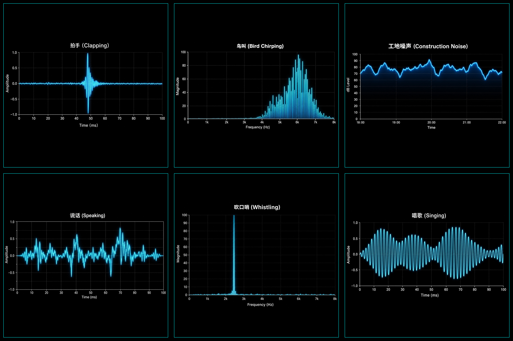

# iot101: ESP32 声音波形可视化

一个给 IoT 新手、小朋友、科技爱好者准备的入门项目：用 ESP32-S3 和 INMP441 数字麦克风采集声音，再用浏览器实时看到声音的波形、频谱和估算分贝。

通过这个项目，你会看到各种有趣的声音波形，如：

- 拍手时，波形会突然变高。
- 吹口哨时，频谱会出现很尖的主峰。
- 说话时，波形会像山脉一样变化。
- 晚上可以观察工地噪声的声级走势。
- 早上可以试着捕捉鸟叫的高频特征。

## 新手小白从头搭建步骤
https://i4ucn.github.io/soundDance-esp32/