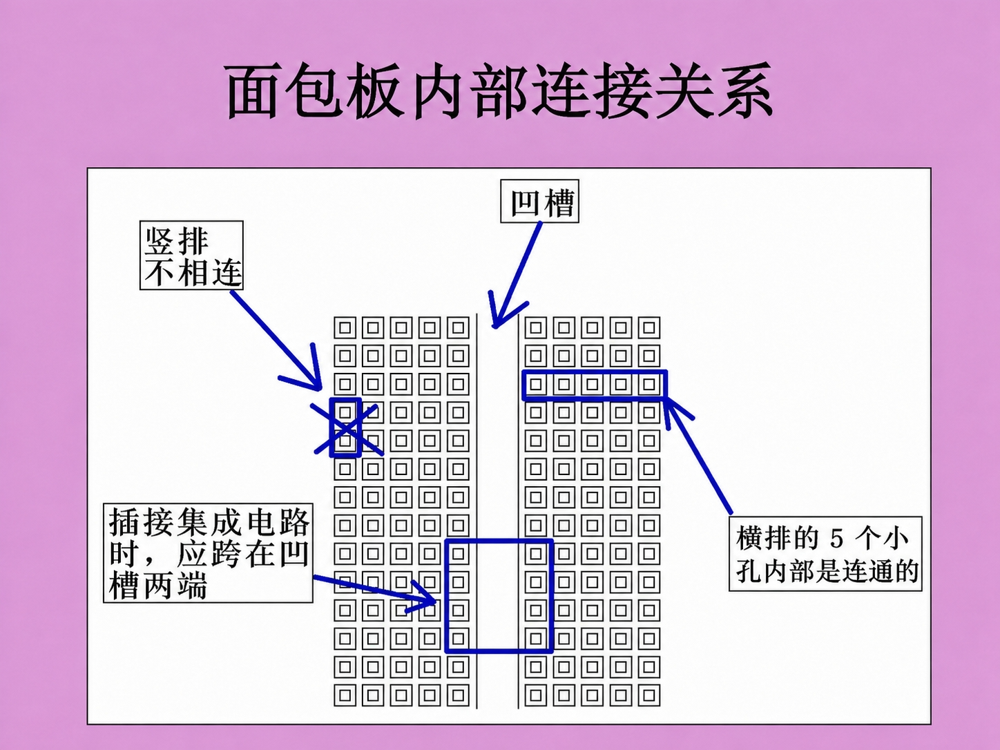

# 第 1 步：认识零件

## ESP32-S3 是什么

ESP32-S3 可以理解成一台很小的电脑。它能读传感器、连 WiFi、开网页，还能把数据发给浏览器。

在这个项目里，ESP32-S3 负责三件事：

1. 给 INMP441 提供 I2S 时钟。
2. 读取麦克风传来的数字声音。
3. 把声音数据通过 WiFi 发给浏览器。

## INMP441 是什么

INMP441 是 I2S 数字麦克风。它和很多普通“声音传感器模块”不一样：

- 普通模拟麦克风输出电压变化。
- INMP441 直接输出数字音频数据。

## INMP441 引脚

| 引脚 | 作用 | 接哪里 |
| --- | --- | --- |
| VDD | 电源 | ESP32 的 3V3 |
| GND | 地 | ESP32 的 GND |
| SCK | I2S 时钟 | 一个普通 GPIO |
| WS | 左右声道时钟 | 一个普通 GPIO |
| SD | 音频数据输出 | 一个普通 GPIO |
| L/R | 左右声道选择 | 先接 GND |

## 面包板是什么

面包板是一块不用焊接的实验板。你可以把 ESP32-S3、INMP441 和杜邦线插在上面，方便反复调整接线。

使用时注意同一排小孔通常是连在一起的，但中间凹槽两边默认不连通。接线前先看清楚行列方向，能少很多排查时间。

## 小朋友可以这样理解

声音像水波一样在空气里传。麦克风像小耳朵，把空气里的波变成数字。ESP32 像小邮差，把这些数字送到浏览器。浏览器像画板，把数字画成波形。
