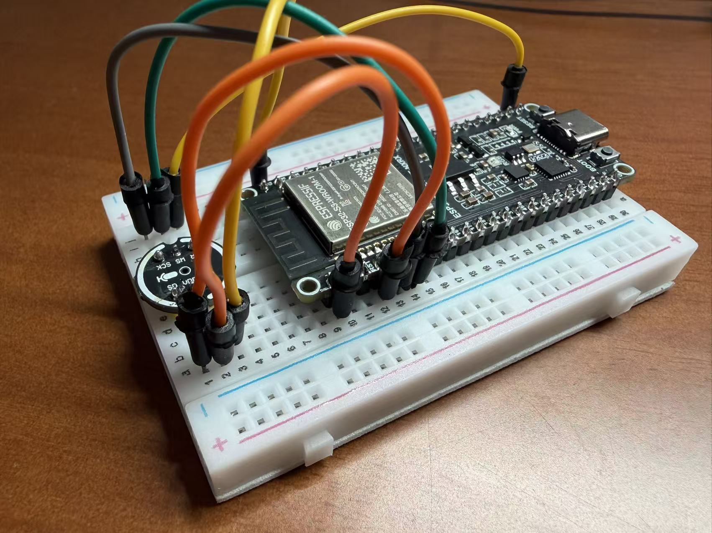

# 第 2 步：接线

## 先断电

接线前先把 ESP32-S3 从 USB 拔下来。接完线、检查一遍，再插 USB。

## 默认接线

| INMP441 | ESP32-S3 |
| --- | --- |
| VDD | 3V3 |
| GND | GND |
| SCK | GPIO5 |
| WS | GPIO6 |
| SD | GPIO4 |
| L/R | GND |

## 检查清单

- VDD 接的是 3V3，不是 5V。
- INMP441 的 GND 和 ESP32 的 GND 已经相连。
- SCK、WS、SD 三根线没有插错行。
- 面包板中间断开的两边不要误以为连通。
